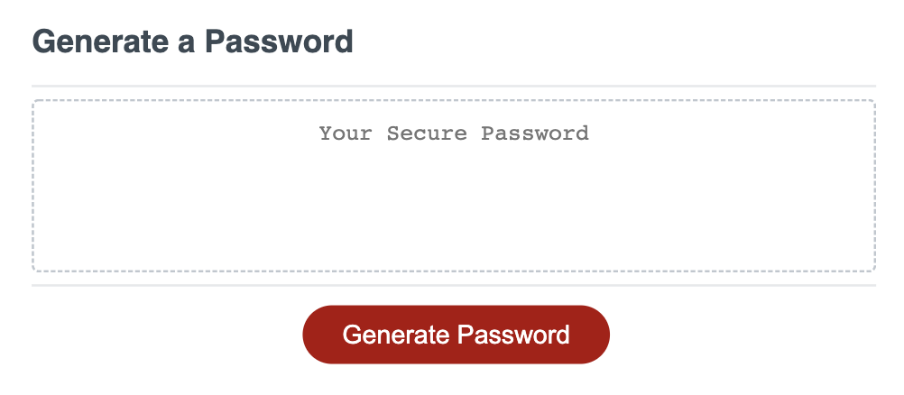
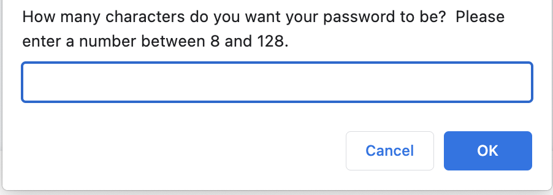
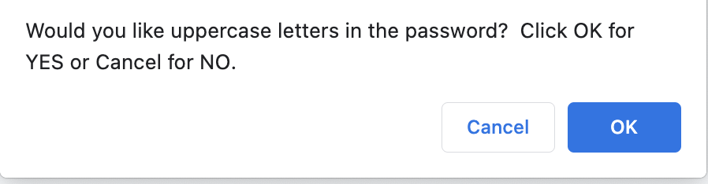
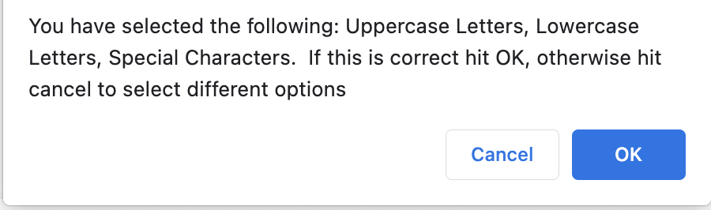
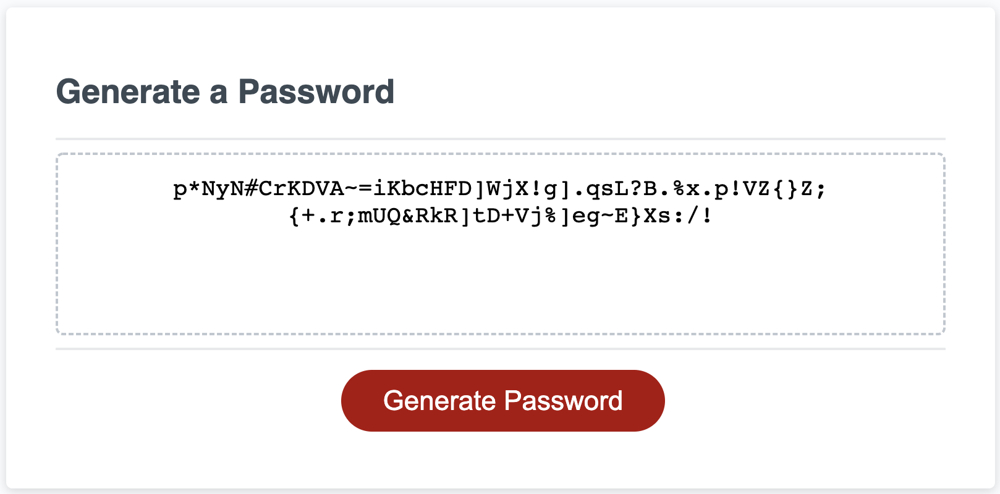

# challenge-three

Password Generator
Site - https://roo116.github.io/challenge-three/

Instructions:

- Click the "Generate Password" button.  
   
   
   
   
- Answer prompts for password length... 
  
   
   
   

- ... and character types. 
   
   
   
   
   
   

- See your password magically appear. 
   
   
   
   
   
   

## Known Issues:

- Code Refactor is required. To meet MVP requirements no code refactor was performed due to time constraints.
- Code to clear the form from a previous password generation is not working. This will be included in a future release.

## MVP Requirements

### User Story

AS AN employee with access to sensitive data.
I WANT to randomly generate a password that meets certain criteria
SO THAT I can create a strong password that provides greater security.

### Acceptance Criteria met with this MVP

GIVEN I need a new, secure password...

1. WHEN I click the button to generate a password THEN I am presented with a series of prompts for password criteria.
2. WHEN prompted for password criteria THEN I select which criteria to include in the password
3. WHEN prompted for the length of the password THEN I choose a length of at least 8 characters and no more than 128 characters
4. WHEN asked for character types to include in the passwordTHEN I confirm whether or not to include lowercase, uppercase, numeric, and/or special characters
5. WHEN I answer each prompt THEN my input should be validated and at least one character type should be selected
6. WHEN all prompts are answered THEN a password is generated that matches the selected criteria
   WHEN the password is generated
7. THEN the password is either displayed in an alert or written to the page
